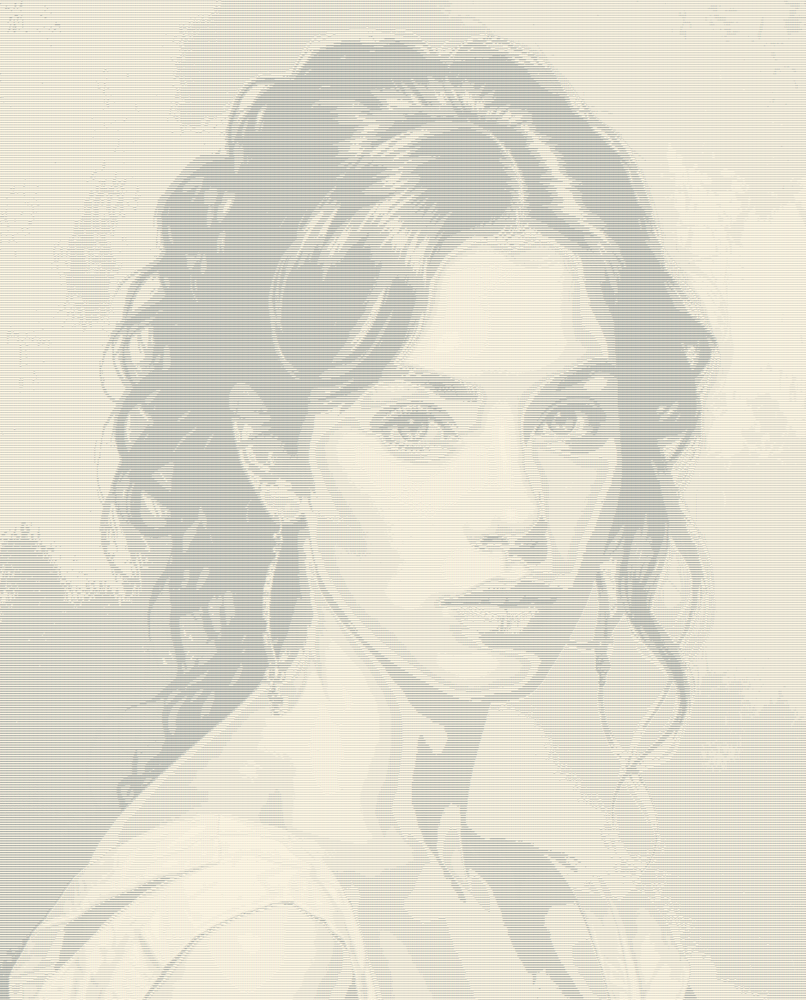

# ASCII Art Converter

This script prompts the user to enter the path to an image and a desired output width.
It resizes the image, converts it to grayscale, and then maps each pixel to an ASCII character
based on brightness. The result is saved in a text file called 'art.txt'.

## Requirements

- Python 3.x
- Pillow library